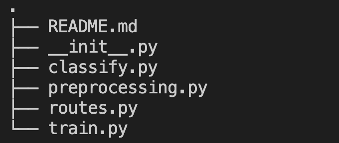

## Internal Functioning of API:

This is the structure in the API: 

- The initialization of the application is done in **__ init __.py** where the flask, redis, and model instance are initialized. 

- The **. ./sb_api.py** takes the above instances and runs the application. 
   - (Note: This is to avoid circular imports in Flask)
   
- The **classify.py** contains classify_process() which classifies by retrieving the data stored in redis.
    - First, it converts the given data JSON data to be ready for the model to predict on, for this:
        - It converts the datetime object stored as string in JSON back to a datetime object with the help of string_to_dateitime function.
        - Converts the JSON data to an np array with the help of preprocess_editor function. 
    - After the preprocessed data is obtained, it performs the necessary predictions and stores them back into redis to be retrieved later.
    - The editor details stored in redis are removed form the queue

- The **routes.py** contains all the necessary API endpoints /predict and /train which are called when post requests are made to the API.
    - The **/predict** endpoint:
        - In this endpoint the input JSON data is pushed into the redis queue after converting into compatible form.
        - The editor ids are stored before hand to retrieve the results mapped with ids stored in redis by classify_process, later on.
        - Unfilled details such as area or bio are set as None to be compatible later on.
        - classify_process() with size is called to load the model and classify the editor accounts retrived back from redis.
        - The results stored in redis by classify_process are retrieved back and sent back to SpamNinja in a JSON format.
    - The **/train** endpoint: 
        - In this endpoint the input JSON data with additional **verdict** parameter and editor details are directly converted into compatible format(np array) to be used by model to retrain.
        - Unfilled details such as area or bio are set as None to be compatible later on and also the datetime objects stored as string in JSON back to a datetime object with the help of string_to_dateitime function.
        - Using preprocess_editor converts finally into an np array.
        - The preprocessed data is sent to retrain_model function to retrain the model.
        - If successfully retrained, a success JSON message is sent.

-   The **preprocessing.py** is used to preprocess the JSON/Dict editor data into proper np array for the model to predict/train on, this uses the initial tokenizers created to convert each parameter properly.

-   The **train.py** contains the retraining part of the model.
    - The data sent to retrain_model is used to retrain the model.
    - The learning rate of the optimizer(Adam) is set to 0.001(very low static value) to learn from new patterns while also keeping in my mind not to forget old learnings(drastic forgetting).
    - The current model is saved as previous_lodbrok.h5 in ../statis/weights/ for future reference if we wanted to come back.
    - Then it calls the train_model function which continues the model learning with new data, The batch is set to only 1 with 2 epochs so as to keep balanced learning.
    - After the training is done, the new model is saved with current_lodbrok.h5 to overwrite over the old model and continue classifying new data over time.
    - The original lodbrok weights are saved in original_lodbrok.h5 to come back and trace the progress done so far.
    - **Benefits of using this method are:**
        - No need to maintain any extra database to store new data sent by SpamNinja and maintain the old data on which the model is trained.
        - There is no fixed size to the batch of data sent to the model, it can be any number of models.
        - The old learnings of the model won't be forgotten soon due to **slow static learning rate** and also the structure of data being the same forever.
    